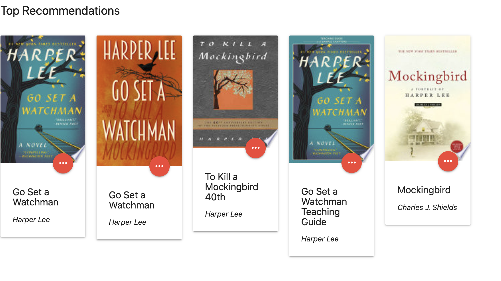
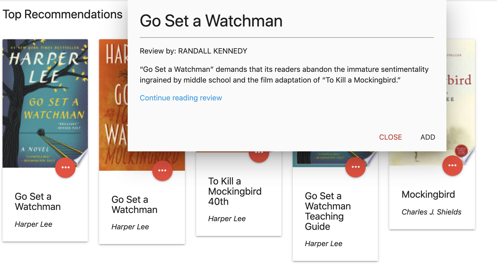
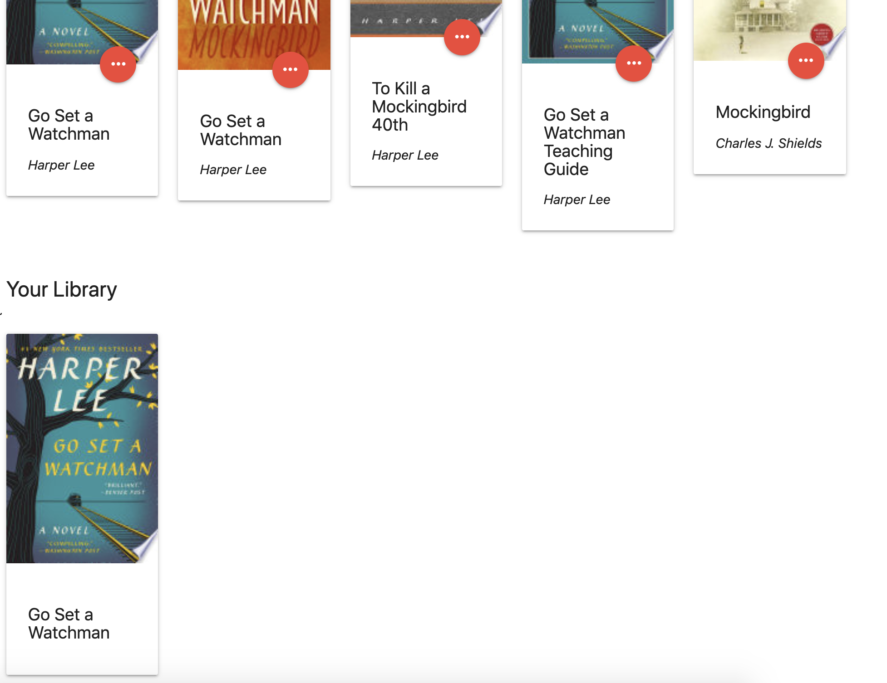

# Project Description
BookWorm App allows a user to search for a book of their liking and add it to "Read Later" library.  When they click on it a modal appears on screen that displays information about that book's most relevant NYTimes book review, if available, as well as a link to the full review on the NYTimes website. After exploring the review, the user has the option to 'save' the book to their library and add it to a stockpile of other saved books to keep track of future reading material. 

# User Story
AS an informed book reader
I WANT to read reviews on top selling books
SO THAT I can add prioritize good books to read

# APIs to be used
Google Books, NYTimes Book Reviews

# USAGE
App can be easily navigated in several steps:
1. Using mouse-pointer to click on the 'search' bar in the doc under 'search a book here...'

2. In the resulting form, type the title of a book that you would like to see available reviews on, and submit with the 'enter' key.

3. Page is populated with the top 5 results from the Google Books API , displaying the most relevant results to your search - mouse-pointer click the '...' icon button over the book card you'd like to see.

4. A modal with the most relevant (if any) NYTimes Book Review on that title will appear, with author inforatmion and a quick summary of the review, as well as a link to take you to the full review. If no results available, modal will say so. 

5. Mouse-pointer click 'close' to close the modal, or 'add' to save the book to your library, and add it to your local storage - keeping a database of your favorite books to be referred to at any later date. 

# Website URL:
https://example.com
# Repository Localtion:
https://github.com/hanaadhami/BookWorm

# Project Contributors:

[Hana Adhami, Holly Blome, Leyla Kaplan, Blake Fogle]

